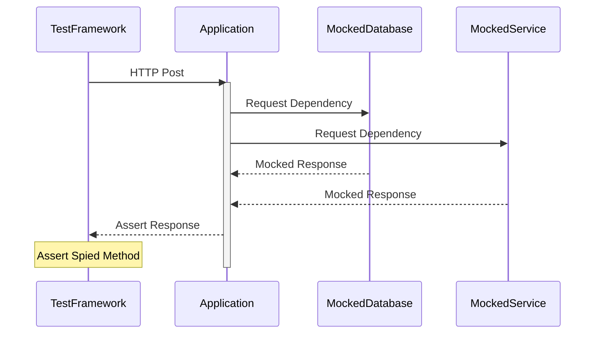

## Context

I found myself starting a project recently where the business rules of the application were quite clear. Further, the value and viability of the idea had already been proven. I had to get something out the door quickly and my first instinct is typically "I'll write the tests later", but this rarely works out. Rather, by focusing on integration tests, the speed penalty of writing tests will pay for itself as your application scales.

### Approaches to testing

The most well-known approach to testing is the [test pyramid](https://martinfowler.com/articles/practical-test-pyramid.html). This defines a model with types of tests, granularity, and tradeoffs for each category of tests.

For example, some of the following statements adhere to the testing pyramid:

- Unit tests isolate the component being tested more than integration tests
- Unit tests typically run faster than integration tests
- There are generally more unit tests than integrations tests
- E2E tests take a long time to run

Kent C Dodds and Guillermo Rauch introduced the [testing trophy](https://kentcdodds.com/blog/the-testing-trophy-and-testing-classifications) which approaches testing from a return on investment mindset arguing that integration tests offer much more return on investment than either end-to-end tests or unit tests.

Furthermore, spotify engineering introduced the concept of the [testing honeycomb](https://engineering.atspotify.com/2018/01/testing-of-microservices/) which like the **testing trophy** focuses on return on investment and complexity.

### Case Study

#### Initial Approach

I started working on my application, focusing mostly on **tdd** with integration tests, and writing tests from the outside in. The majority of my tests were defined by the following boundaries.



A typical test looked as follows

```typescript
it('sends a helpful message, when getting removed to a list fails, and the last message is "Unsubscribe"', async () => {
  // Setting up
  (removeSubscriberFromList as jest.Mock).mockRejectedValue(new Error());
  // Mocking a database access method
  (listMessages as jest.Mock).mockResolvedValue([
    null,
    Factories.buildRecord('MessageInstance', {
      body: 'Unsubscribe',
    }),
  ]);
  const incomingMessage = Factories.buildResponse('incomingMessage', {
    Body: 'Pickup',
  });

  // Acting
  const response = await request(app)
    .post('/message')
    .type('form')
    .send(incomingMessage);

  // Asserting
  expect(response.status).toEqual(400);
  expect(sendMessage).toHaveBeenCalledWith(
    expect.objectContaining({
      message: `Something went wrong removing you from the list: "Pickup". Contact the organizer or try again later`,
    })
  );
});
```

The majority of my tests were structured this way and kept the same boundaries. As I found areas that had their own specific set of complexities I added unit tests around those areas or focused in on a more isolated integration test.

Looking back at first it felt like the tests weren't accomplishing what I had hoped.

#### The Refactor

I learned a lot throughout this project; from building out CloudFormation scripts, to deployment pipelines using Github, ECR and ECS.

**Fortunately, I learned that the internals of my application were built wrong.**

Essentially my `Controller` and my `Model` layer were doing more than they should have been, and I was under-utilizing services. This resulted in unclear boundaries within my application.

So I started refactoring, and to my surprise...and delight. **None of my tests had to change**. I could refactor with confidence, knowing that the business logic I had tested, would still work as long as my tests passed.

## Conclusion(s)

Writing tests outside-in shouldn't dictate what the shape of your test ends up being. Rather, it's an approach of where to apply effort first.

- When starting a project, write tests
- Focus on tests at an integration level first
  - Trophy for frontend
  - Honeycomb for services
- Isolate logic and drill-down based on complexity

Depending on your application, essential complexity and the maturity of your product or service, you may end up with a pyramid.
